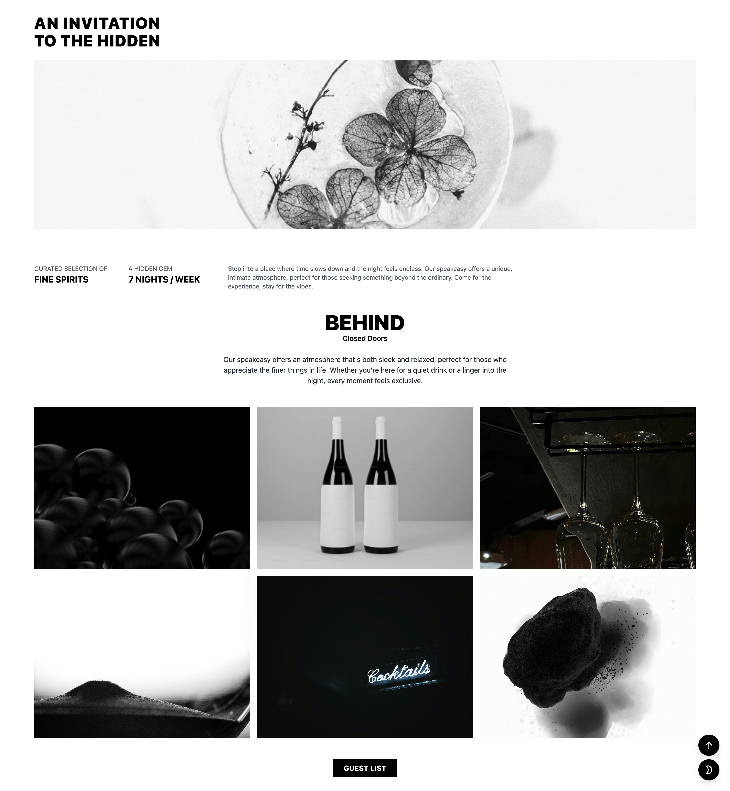
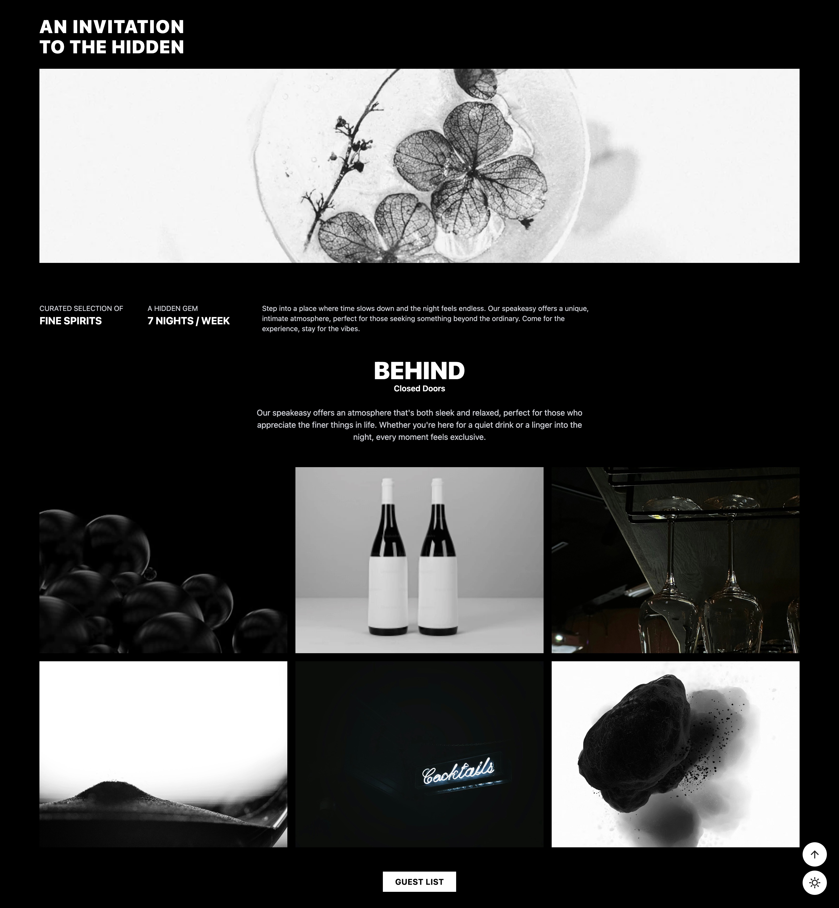

# An Invitation to the Hidden – Exclusive Speakeasy Website

_Fig 1. Daytime Elegance - Light mode interface_

_Fig 2. Nighttime Ambiance - Dark mode interface_

A sleek, mobile-first, and responsive landing page for an exclusive speakeasy bar.  
This project showcases a curated gallery of high-quality images, smooth dark mode toggling, and interactive UI features — all built with **Tailwind CSS (via CDN)** and vanilla JavaScript.

---

## 🌟 Features

- **Fully Responsive Design** – Mobile-first layout with optimized breakpoints for all devices.
- **Tailwind CSS** – Styling powered by Tailwind via CDN for rapid prototyping and customization.
- **Dark Mode Toggle** – User preference-aware theme switching with icon updates.
- **Image Modal** – Click-to-enlarge gallery images with an accessible modal view.
- **Scroll-to-Top Button** – Smooth scrolling with dynamic visibility based on scroll position.
